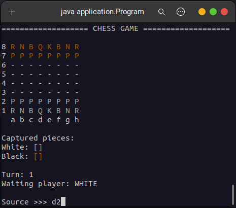
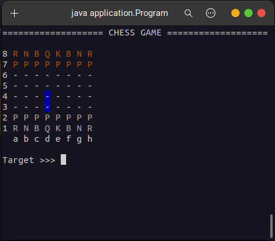

# `chess-game`

This repo is the Chess Game implemented as a CLI Java Program.

It was one of the first projects that I used to learn basic principles of Java and OOP, namely:
- Classes and objects;
- Static members;
- Constructors;
- `this` keyword;
- Overriding and overloading;
- Encapsulation;
- Access modifiers, getters and setters;
- Boxing, unboxing and wrapper classes;
- Enumeration;
- Composition;
- Inheritance, upcasting and downcasting;
- Polymorphism, abstract classes and methods; and
- Exception handling.

## Screenshots

_The implementation is based on a [Java course](https://www.udemy.com/course/java-curso-completo/) available at Udemy, by [Nelio Alves](https://github.com/acenelio)._